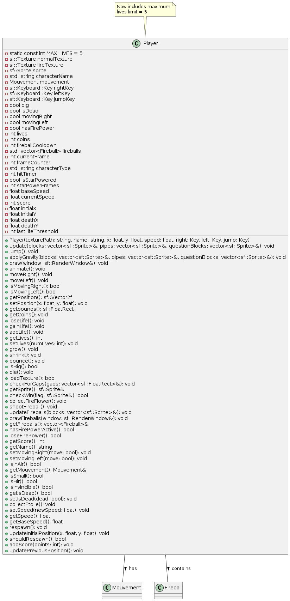
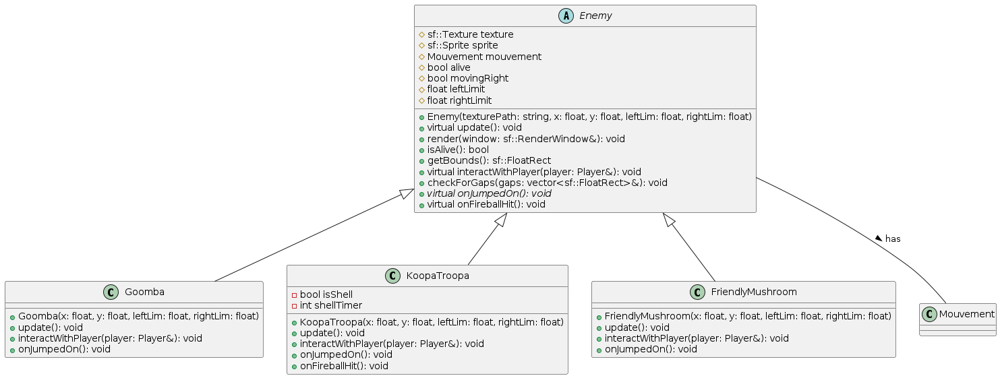

# Mario Bros (SFML, C++, Makefile)

## **Description du Projet**

Ce projet est une version personnalisée de **Mario Bros** développée en **C++** avec l'utilisation de la bibliothèque  SFML . Il inclut un menu de démarrage avec plusieurs modes de jeu :

* **2 vs 2** : Mario contre Luigi (chaque personnage est contrôlé par un joueur).
* **Joueur vs IA** : Mario est contrôlé par le joueur tandis que Luigi est contrôlé par une IA.

## **Dépendances**

* **SFML** : Gestion des graphiques, audio et événements.
* **C++** : Langage de programmation principal.
* **Makefile** : Pour automatiser la compilation.

## **Installation**

### 1. **Cloner le dépôt**

Pour récupérer le code source, ouvrez un terminal et entrez la commande suivante :

```bash
git clone https://github.com/votre-utilisateur/mario-bros.git
cd mario-bros
```

### 2. **Installer les dépendances**

Assurez-vous d’avoir installé  **SFML** , **g++** et  **Make** .

#### Installation sur Linux (Ubuntu/Debian) :

```bash
sudo apt update
sudo apt install libsfml-dev build-essential
```

### 3. **Compilation et Lancement**

Pour compiler le projet, utilisez le Makefile inclus :

```bash
cd Mario_Bros/src
make
```

Puis lancez le jeu :

```bash
./mario
```

Si vous voulez nettoyer les fichiers générés :

```bash
make clean
```

## **Comment Jouer**

### **Menu Principal**

Lorsque le jeu démarre, vous accédez à un **menu** avec plusieurs options :

**Jouer en 2 vs 2** :

* Mario et Luigi sont contrôlés par deux joueurs.
* Les contrôles sont les suivants :
  * **Mario** : Flèches directionnelles + touches de saut/tir.
  * **Luigi** : Touches **WASD** + touches de saut/tir.

**Joueur vs IA** :

* Mario est contrôlé par le joueur.
* Luigi est contrôlé par une IA programmée pour réagir intelligemment à l'environnement du jeu.

## **But du Jeu**

Le but du jeu est de **collecter le plus de pièces** et d’atteindre le drapeau en premier tout en surmontant les obstacles !

### **Objectifs principaux** :

* Collecter le plus de pièces pour augmenter votre score.
* Éviter les obstacles (trous, blocks, pipe) pour ne pas perdre et continuer à avancer.
* Échapper aux ennemis ou les éliminer si possible en sautant dessus.
* Récupérer des pouvoirs (champignons, étoiles, fleur) pour gagner des avantages temporaires (devenir plus grand, super vitesse, lancer des boules de feu).
* **Atteindre le drapeau en premier **: Le premier joueur à toucher le drapeau remporte la partie !

Le gagnant est celui qui **atteint le drapeau en premier** ou qui a le **meilleur score** en cas d’égalité !

## **Gestion des Vies et du Score**

* Le joueur commence avec 3 vies .
* Le score augmente en :
  * Collectant des pièces
  * Tuant des ennemis
* **À chaque 100 points** , le joueur  **gagne une vie supplémentaire**.
* Si le joueur meurt mais a encore une vie disponible, il **revient à l'endroit où il est mort** sans recommencer le niveau depuis le début.
* S’il n’a plus de vies, c’est Game Over !

## **Comment jouer?**

### **Contrôles**

*(Mode Joueur vs Joueur)*

| Action                         | Mario (Joueur 1) | Luigi (Joueur 2) |
| ------------------------------ | ---------------- | ---------------- |
| **Avancer**              | Flèche →       | **D**      |
| **Reculer**              | Flèche ←       | **Q**      |
| **Sauter**               | Flèche ↑       | **Z**      |
| **Tirer (Boule de feu)** | **Espace** | **F**      |

*(Mode Joueur vs IA)*

* Mario est contrôlé par le joueur :

  Avancer → Flèche →

  Reculer → Flèche ←

  Sauter → Flèche ↑

  Tirer (Boule de feu) → Espace
* **Luigi** est contrôlé par une IA qui se déplace automatiquement.

## Description des classes principales

### Classe Player

La classe `Player` représente les joueurs dans le jeu Mario Bros. Elle permet de gérer toutes les fonctionnalités liées au personnage :

* Déplacement (droite, gauche, saut)
* Gestion des collisions (avec les blocs, les tuyaux, les trous)
* Animation du personnage (en fonction de la direction et de l'état)
* Gestion de la vie, des pièces et des pouvoirs
* Lancer de boules de feu (si le joueur a le pouvoir de feu)
* Gestion de l'état (grand, petit, étoile, mort)
* Détection de la victoire (atteinte du drapeau)

**Diagramme UML de la Classe `Player`**



### Classe Enemy

- Classe de base pour tous les ennemis
- Implémente le comportement de base (mouvement, collision)
- Gère l'état de vie et la logique de défaite
- Inclut des méthodes virtuelles pour les comportements spécifiques

  

#### Classe FriendlyMushroom

- Hérite de Enemy mais agit comme un power-up
- Fait grandir le joueur lors de la collecte
- Se déplace horizontalement et change de direction aux obstacles

#### Classe FireFlower

- Power-up qui donne au joueur la capacité de lancer des boules de feu
- Apparaît dans certains blocs spéciaux
- Reste statique et attend d'être collectée

#### Classe Fireball

- Projectile lancé par le joueur avec le power-up feu
- Se déplace dans la direction du lancement
- Rebondit sur les surfaces et détruit les ennemis au contact

#### Classe Coin

- Objet collectible qui augmente le score du joueur
- Apparaît dans les niveaux ou sort des blocs frappés

#### Classe Camera

- Gère la vue du jeu et suit le joueur
- Implémente des limites pour ne pas montrer hors du niveau
- Adapte la vue à la taille de la fenêtre

#### Classe Background

- Charge et affiche l'environnement du jeu
- Gère les tuiles de sol, les tuyaux, les blocs et le ciel
- Fournit des méthodes pour accéder aux éléments du niveau

#### Classe AIPlayer

- Contrôle un personnage secondaire (Luigi) par IA
- Prend des décisions basées sur l'environnement et les ennemis
- Implémente différentes stratégies (éviter les ennemis, sauter les obstacles)

### Logique du jeu

1. **Boucle principale**:

   - Gestion des entrées utilisateur
   - Mise à jour des états des objets
   - Détection des collisions
   - Rendu graphique
2. **Système de collision**:

   - Détection précise avec des rectangles englobants
   - Traitement différent selon le type d'objet
   - Gestion des collisions latérales et verticales
3. **Système de power-ups**:

   - Les champignons rendent Mario plus grand
   - Les fleurs de feu permettent de lancer des projectiles
   - Effets temporaires et permanents
4. **Système d'IA**:

   - Prise de décision basée sur des probabilités
   - Détection d'obstacles et d'ennemis
   - Comportement adaptatif selon la situation
5. **Gestion des niveaux**:

   - Chargement à partir de fichiers texte
   - Placement des objets selon une grille
   - Vérification des conditions de victoire
